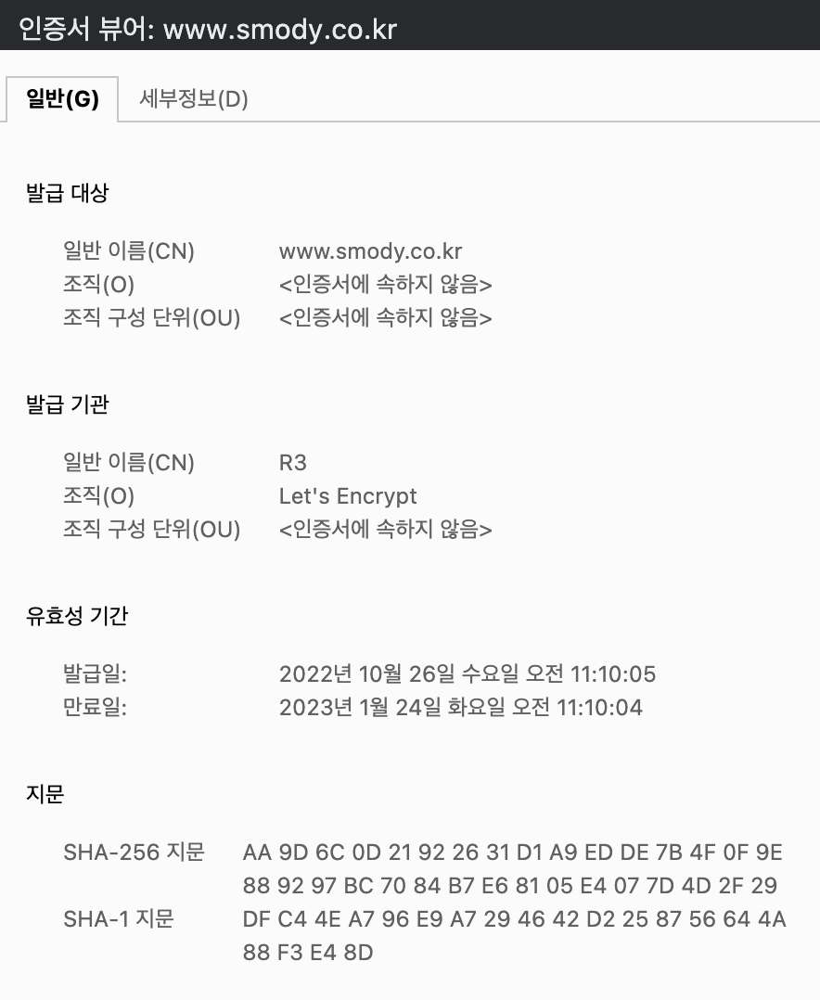

## Webroot 방식

SSL 인증서 발급 방법에는 dns, standalone, webroot 방식 등이 있다.

이전에는 `dns` 방식을 사용하여 SSL 인증서 발급을 하였다. 관련한 내용은 아래의 포스팅 링크클 통해 확인할 수 있다.

[Marco - 배포 및 HTTPS 설정(EC2, Nginx, certbot)](https://wonsss.github.io/deploy/deploy-https/)

그리고 `standalone` 방식은 certbot이 임시로 웹 서버를 구동해 도메인 인증 요청을 처리한다. 그러나 이 때문에 발급 또는 갱신 시마다 서버를 잠시 내려야 하는 문제가 있다.

반면, `webroot` 방식의 SSL 인증서 발급 원리는 도메인 인증을 위해 외부에서 접근 가능한 경로를 제공하며, 인증기관인 LetsEncrypt에서 해당 경로로 접속하여 파일 업로드를 시도하고 파일이 해당 위치에 정상적으로 업로드되면 인증서가 발급된다. 따라서 standalone과는 달리 인증 시 서버를 내리지 않아도 된다.

이번에는 `webroot` 방식을 사용하여 SSL 인증서 발급을 받아본다.

### letsencrypt가 파일을 업로드할 수 있도록 설정하기

- Webroot 방식의 SSL 인증서 발급을 위한 Nginx 설정
  - `sites-available` 폴더에 Webroot 방식의 SSL 인증서 발급을 위한 Nginx 설정을 한다.

```jsx
sudo vi /etc/nginx/sites-available/smody.conf
```

```bash
// smody.conf 내 다음 내용만 있도록 작성
server {
    listen 80;
    listen [::]:80;

    root /var/www/html;
    index index.html index.htm index.nginx-debian.html;

    server_name smody.co.kr www.smody.co.kr;

    location / {
        try_files $uri $uri/ =404;
    }
}
```

- 설정 후 nginx reload

```bash
sudo nginx -s reload
```

### webroot 방식으로 인증서 발급받기

- certbot을 이용해 Let’s Encrypt 로부터 SSL 인증서를 발급받는다
  - --webroot : webroot 방식으로 SSL 인증서를 발급 받겠다는 설정
  - -m : 이메일 입력
  - -w : webroor 방식의 인증을 위해 사용할 폴더 디렉토리 설정, ec2 인스턴스 내부에 존재하는 디렉토리여야 한다.
  - -d : 인증서를 발급 받을 도메인 설정

```bash
sudo certbot certonly --webroot --agree-tos -m my@gmail.com -w /var/www/html -d www.smody.co.kr
```

- 정상적으로 인증이 되었다면 `Certificate` 와 `Key` 가 .pem 파일 형태로 ec2 에 저장이 된다.


## conf 수정

- 인증서가 발급되었으니 위에서 smody.conf 내에 작성한 webroot 코드는 제거하고, 다음과 같은 코드를 작성한다.

```bash
server {
    location / {
        root   /home/ubuntu/dist;
        index  index.html index.htm;
        try_files $uri $uri/ /index.html;
    }

    location ~* \.(?:js)$ {
        root /home/ubuntu/dist;
        expires 1y;
        add_header Cache-Control "public, no-transform";
        try_files $uri $uri/;
    }

    listen 443 ssl http2; 
    
    ssl_certificate /etc/letsencrypt/live/www.smody.co.kr/fullchain.pem; 
    ssl_certificate_key /etc/letsencrypt/live/ww.smody.co.kr/privkey.pem; 
    include /etc/letsencrypt/options-ssl-nginx.conf; 
    ssl_dhparam /etc/letsencrypt/ssl-dhparams.pem; 
}

server {
    if ($host = www.smody.co.kr) {
        return 301 https://$host$request_uri;
    } # managed by Certbot

    server_name www.smody.co.kr;
    listen 80;
    return 404; # managed by Certbot
}
```

- 설정 후 nginx 재시작

```bash
sudo service nginx restart
```

- 갱신된 인증서 적용 완료



다음에는 인증서 자동 갱신을 적용해야겠다.

[[참고] 최신 Let’s Encrypt SSL 인증서 발급 방법 4가지 정리](https://happist.com/573990)

[[참고] ssl 적용- webroot방식(with apache)](https://doohong.github.io/2019/06/22/SSL-WebRoot/)
