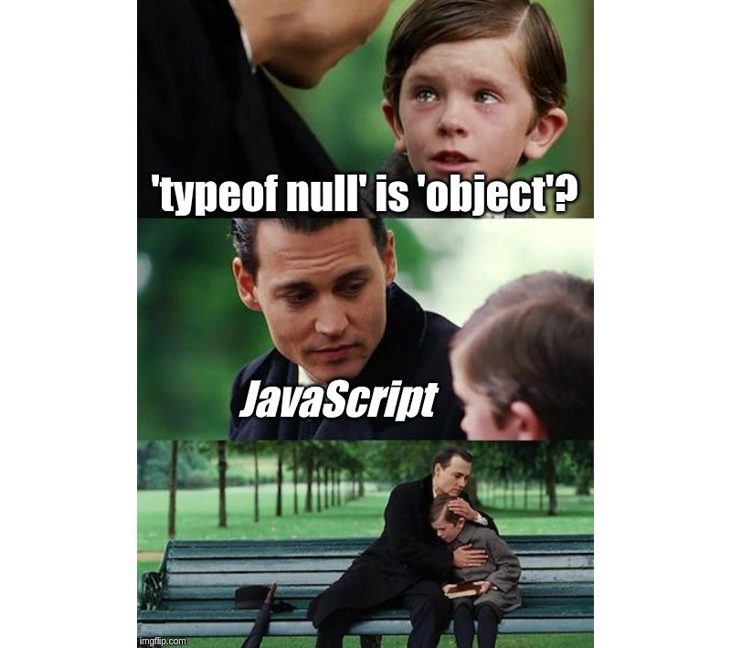
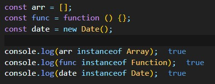
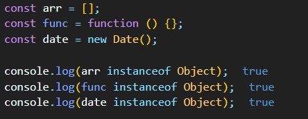
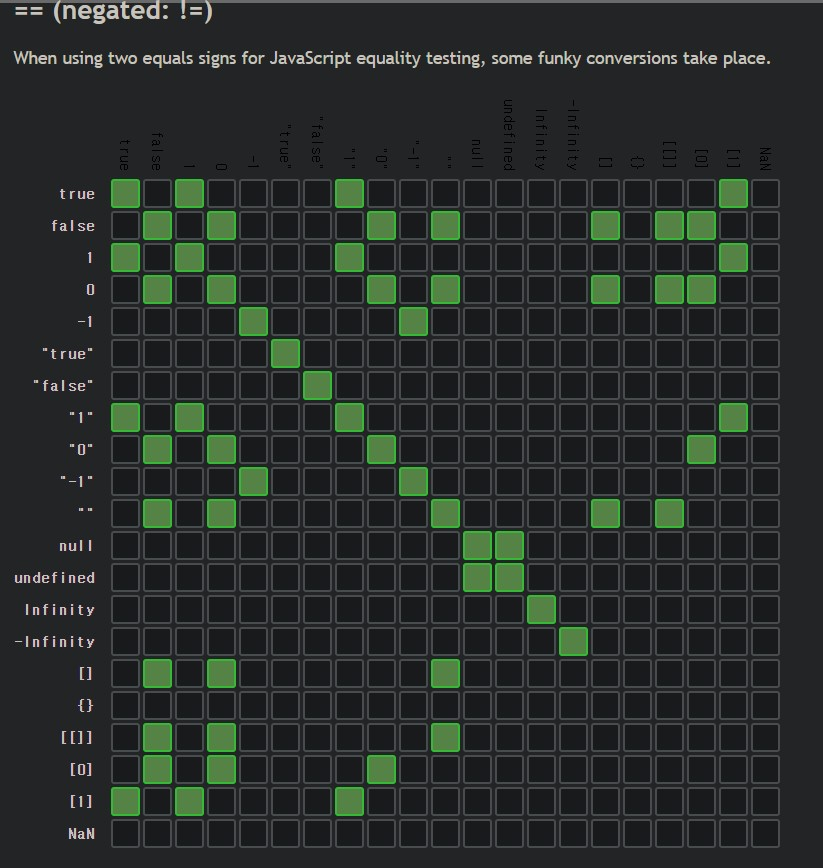
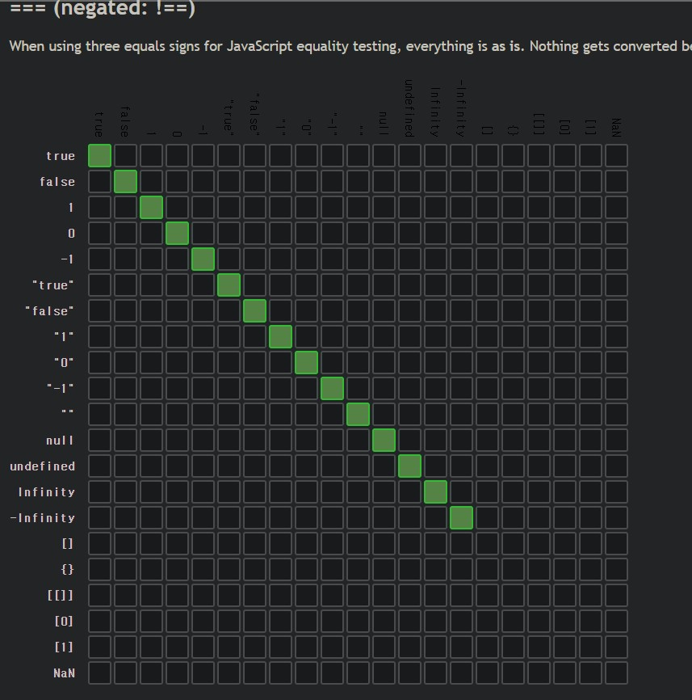
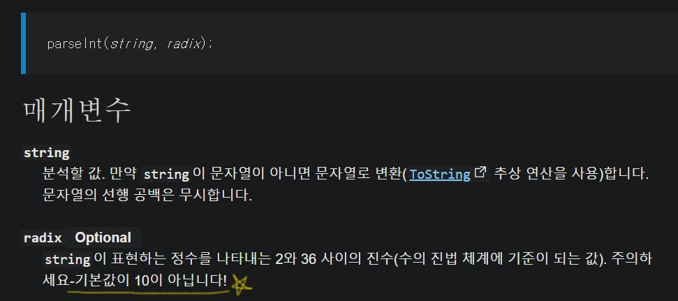
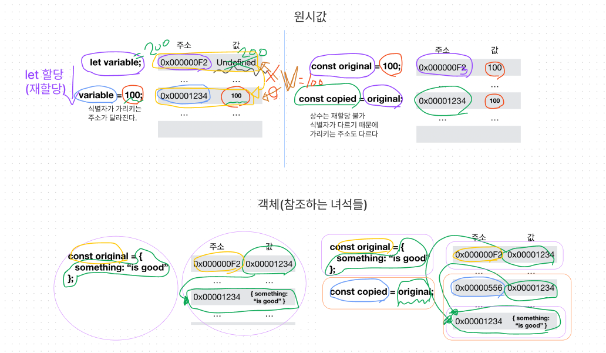

# 1. 변수 다루기


## 자바스크립트 특성 파악하기

- 몽키 패치
  - 런타임 중인 프로그램의 내용이 변경되는 행동을 의미한다.
- 자바스크립트는 여러 언어의 특성이 합쳐졌다.
  - 문법은 자바와 비슷하다.
  - 문자열과 배열 정규표현식은 펄과 비슷하다.
  - 함수는 오크와 비슷하다.
  - 클로저와 스코프화경은 스키마와 비슷하다.
  - 프토토타입 개념은 셀프에서 왔다.
  - 이벤트는 하이퍼토크에서 왔다.
- 좋은 장점도 있지만, 나쁜 단점도 있다.

## var를 지양하자

- var는 함수 스코프를 가진다.
- let과 const는 블록 단위 스코프와 TDZ라는 특성을 가진다. 이를 통해 안전해진다.
  - let과 const는 재선언할 수 없고
  - let은 재할당할 수 있으나, const는 재할당할 수 없다.

## function scope & block scope

```jsx
var global = '전역'

if(global === '전역') {
  var global = '지역';
  console.log(global); //지역
}

console.log(global); //지역
```

- var는 함수 단위 스코프라서, 함수 내에서 선언 할당된 경우 그 안에서 영향을 미치는데,
  - 위 코드에서는 함수가 아닌 if문 내에서 선언 할당된 var가 전역까지 영향을 미치고 있다.

```jsx
let global = '전역'

if(global === '전역') {
  let global = '지역';
  console.log(global); //지역
}

console.log(global); //전역
```

- let을 사용하자, 블록 단위 선언 할당된 let은 블록 내에서만 영향을 미치고, 블록 바깥 전역으로는 영향을 못 미친다. 위에서 예약어를 let을 const로 바꿔도 마찬가지다.

### let보다 const를 우선적으로 사용하는 편이 낫다

- let을 쓸 경우 재할당이 되어 데이터가 바뀔 수도 있기 때문이다.

- const 객체 내 프로퍼티의 값은 바꿀 수 있다. const는 재할당만 금지한다. 객체나 배열 같은 레퍼런스 객체들을 조작할 때는 이상이 없다.

```jsx
const person = {
  name: 'jang',
  age: '30',
}

person.name = 'lee'
person.age = '22'

console.log(person)

/*[object Object] {
  age: "22",
  name: "lee"
}*/
```

## 전역 공간 사용 최소화

- 전역공간 : window(브라우저), global(nodeJS) 등...
  - 전역공간은 최상위 환경이며, 브라우저와 노드JS환경에 각각 있다.
- 왜 전역 공간을 침범하면 안되냐?
  - 파일을 나눠도 스코프는 나눠지지 않는다. 전역 공간에 침범하여 저장하면 어디서나 접근될 수 있다.
- 해결 방법
    1. 애초에 전역변수를 만들지 않는다.
    2. 지역변수로만 만든다.
    3. window,global을 조작하지 않는다.
    4. const, let 을 사용한다
    5. IIFE(즉시실행함수), Module, Closuer, → 스코프를 나누기

## 임시 변수 제거하기

- 임시 변수는 scope 안에서 전역변수처럼 활용되는 변수를 의미한다.
  - 임시 변수가 있는 객체도 규모가 커지면 전역 공간이나 다름 없는 상황이 올 수 있다. 그러면 이 임시 객체가 매우 위험한 요소가 될 수 있다.
  - 임시변수는 명령형으로 가득한 로직이라 좋지 않다.
  - 임시변수를 사용하면 어디서 무엇이 잘못됐는지 알 수 없어서 디버깅 하기 힘들다.
  - 임시변수를 사용하면 추가적인 코드 작성의 유혹이 생겨 유지보수를 힘들게 만든다.
- 임시변수나 임시객체를 어떻게 CRUD(조작)할 수 있을까?
  - 물론 함수를 많이 쪼개면 좋으나, 더 간단한 방법은 임시변수(객체)를 만들지 않고 바로 객체로 반환하는 것이다.
  - 임시 객체가 생기면, 여기에 계속 접근해서 뭔가 만들고 넣고 지우는 CRUD가 반복될 위험이 있어서 좋지 않다.
- 해결책
    1. 함수 나누기
    2. 바로 반환한다

    ```jsx
    function getElements() {
    const result = {}; //임시 객체
    result.title = document.querySelector('.title'),
        result.text = document.querySelector('.text'),
        result.value= document.querySelector('.value')
    return result;
    }
    ```

    ⬇️ 위 코드처럼 임시객체를 두지 말고 아래 코드처럼 바로 객체로 반환

    ```jsx
    function getElements() {
    return {
        title: document.querySelector('.title'),
        text: document.querySelector('.text'),
        value: document.querySelector('.value')
    };
    }
    ```

    3. 고차함수(map, filter, reduce) 사용
    4. 선언형 코드로 바꾼다

## 호이스팅 주의하기

- 호이스팅은 선언과 할당이 분리된 것을 생각하면 쉽다. 런타임(코드 동작) 시기에 선언과 할당이 분리된다.
- 호이스팅은 런타임 시에 선언을 최상단으로 끌어올려주는 것이다.
- 코드를 작성할 때는 스코프 동작을 예상하는데, 런타임에서는 생각대로 동작하지 않는다. 그 이유는 호이스팅 때문이다.

```js
var global = 0; //var는 함수 스코프를 가진다

function outer() {
  console.log(global);  // undefined
  // 위 콘솔로그의 undefined는 아래의 var global의 호이스팅이 동작했기 때문이다. 만약 아래의 var global = 5 코드가 없었다면, 1라인의 var glboal = 0;에 의해 콘솔에 0이 찍힌다.
  var global = 5;

  function inner() {
    var global = 10;
    console.log(global);  // 10
  }

  inner();
  global = 1;
  console.log(global); // 1
}

outer();
```

- 함수도 호이스팅된다. 함수선언문으로 변수가 덮어질 수 있다.
- 함수를 만들 때 const를 사용해서 만든 후 함수를 할당하는 방식이 추천된다.

```js
// 아래처럼 함수표현식으로 만드는 것이 권장됨
const sum = function() {
  return 1 + 2;
}
```

- 해결책
    1. var를 사용하지 않는다. const를 사용한다.
    2. 함수도 조심한다. 함수 표현식을 사용한다.

# 2. 타입 검사 방법



## typeof

- `typeof` 연산자는 문자열로 반환한다.
- typeof만으로 모든 타입 검사가 다 커버되진 않는다.
- 자바스크립트에서 타입을 크게 구분해보면, `Primitive(원시값)` 와 `Reference(참조값)` 으로 나눠진다.
- 원시값은 typeof로 잘 검사할 수 있으나, 참조값은 typeof로 구분하기 어렵다. 따라서 typeof가 만능이 아니다.
- 자바스크립트는 동적으로 변하는 언어이기 때문에, 타입도 동적이다. 동적으로 변하는 타입을 검사하기 어려우므로 주의해야 한다.

  

- typeof는 Wrapper 객체로 된 원시값들의 타입을 원시값 타입으로 표시하지 못한다.

  

- typeof는 function과 class 모두 function으로 표시한다. (class는 function에 대한 문법적 설탕..?)
- 또한, array, object, null을 모두 object 표시한다. null의 타입이 object로 표시되는 것은 자바스크립트에서도 인정한 오류이다.
  

## instanceof

- `instanceof` 연산자는 `typeof` 연산자와 비슷하다. `instanceof` 연산자는 객체의 프로토타입 체인을 검사하는 연산자이다.
  - 해당 인스턴스가 어떤 객체의 인스턴스인지 여부를 확인할 수 있다.
  

- 모든 인스턴스는 본질적으로 객체의 인스턴스이다. 자바스크립트에서 함수, 배열, 데이트 객체 같은 경우에는 프로토타입 체인을 타기 때문에 최상위에는 `Object` 가 있다.
  

- 이런 특성 때문에 타입 검사를 하는 것이 더욱 어렵다. 이러한 타입 검사에 어려움이 있어서 또 하나 제공되는 기능이 있다.

## Object.prototype.toString.call('')

- `Object.prototype.toString.call('')` 를 사용하면, 문자열 안에 대괄호로 묶여서 타입이 표시된다.
  - 이 기능은 Wrapper 객체의 타입까지 정확하게 표시할 수 있다.  


## 요약

- 자바스크립트에서 타입은 동적이므로, 타입 검사가 어렵다. 많은 타입 검사 방법이 있기 때문에,  어떤 타입을 검사할 때마다 구글(스택오버플로우 등)에 검색해서 그 상황에 최적인 방법을  선택하는 것이 좋다.(또한 웹페이지나 답변글의 게시일이 최신인지 확인)

# 3. undefined와 null 비교


- undefined와 null을 사용할 때 여러 경우에서 헷갈린다.
- MDN에서는 각각에 대해 다음과 같이 정의한다.
  - `null`은 JavaScript의 [원시 값](https://developer.mozilla.org/ko/docs/Glossary/Primitive) 중 하나로, 어떤 값이 의도적으로 비어있음을 표현하며 불리언 연산에서는 [거짓](https://developer.mozilla.org/ko/docs/Glossary/Falsy)으로 취급합니다
  - 전역 `undefined` 속성은 [undefined] 원시 값을 나타내며, JavaScript의 [원시 자료형](https://developer.mozilla.org/ko/docs/Glossary/Primitive) 중 하나입니다.
- null과 undefined에 대해 살펴보자.

## null

- null에 대해 not 연산자를 사용하면 다음과 같이 피연산자 null을 불린형(null의 불린형은 false)으로 변환하고 그 역을 반환한다.

```jsx
console.log(!null) // true
console.log(!!null) //false
console.log(!null === true) // true
console.log(!!null === false) // true
```

- 하지만, 그냥 `null ===  false` 를 평가해보면, 둘은 다르다고 반환된다...

```jsx
console.log(null === false) //false
```

- null은 수학적으로는 0이다.

```jsx
// null은 수학적으로는 0이다.
console.log(null + 123) // 123
```

## undefined

- undefined는 아무것도 지정하지 않았을 때 기본값이다. 즉, 변수를 선언했지만 값을 정의(할당)하지 않은 것이다.

```jsx
let varb
console.log(varb) // undefined
console.log(typeof varb); // undefined
```

- undefined에 대해 not 연산자를 사용하면 null처럼 true 불린형이 된다.

```jsx
console.log(!undefined); // true
console.log(!!undefined); // false
```

- 하지만 undefined와 null이 같냐고 평가하면 역시 다르다고 반환된다.

```jsx
console.log(undefined === null) // false
```

- undefined로 산수를 하면 null과는 다르게 NaN가 나온다.

```jsx
console.log(undefined + 123) // NaN
```

## 요약

- 따라서 undefined와 null을 함께 활용한 코드를 작성하기보다는, 팀에서 비어 있는 값을 둘 중에 무엇으로 할 지 컨벤션을 정하여 일관성있게 사용하는 것이 좋다.
  - null과 undefined를 쓸 때 아래와 같은 특성을 파악하고 조심해야 한다.
- null과 undefined 비교 정리
  - null
    - 값이 없음을 명시적으로 표현하기 위한 값
    - 수학적으로 0에 가깝다.
    - type은 object이다.
  - undefined
    - 값이 정의되지 않았을 때 기본으로 정해지는 값
    - 수학적으로 사용하려고 하면 NaN가 나온다.
    - type은 undefined이다.

# 4. qeq 줄이기


## 동등 연산자(==, eqeq)

- 동등 연산자(== , Equality)
  - `[MDN정의]` : 동등 연산자(==)는 두 개의 피연산자가 동일한지 확인하며, Boolean값을 반환합니다. 일치 연산자(===)와는 다르게 다른 타입의 피연산자들끼리의 비교를 시도합니다.
  - '='이 equality인데 이를 줄여서 말하면 eq이고, 동등연산자는 '='이 두 개이므로 `eqeq`라고 부르기도 한다.

- 동등 연산자를 사용하면 형 변환(type casting)이 일어난다.
  - 검사만 했을 뿐인데, 형 변환(type casting)이 발생하므로 위험하다.
  - 이처럼 느스한 동등 연산자로 검사하면, 나중에 어떠한 오류를 불러올지 모르므로 위험하다.

```jsx
console.log('1' == 1);  // true
console.log(1 == true); // true
```



## 일치 연산자(===, eqeqeq)

- 일치 연산자(===, Strict Eqaulity)
  - `[MDN정의]` : 일치 연산자(===)는 두 개의 피연산자가 동일한지 확인하며, Boolean 값을 반환합니다. 동등 연산자(==)와는 다르게 다른 타입의 피연산자를 항상 다른 것으로 간주합니다.
  - '='이 equality인데 이를 줄여서 말하면 eq이고, 일치연산자는 '='이 세 개이므로 `eqeqeq`라고 부르기도 한다.

```jsx
console.log('1' === 1); // false
console.log(1 === true); // false
```

- 어떻게든 형 변환을 수동으로 한 다음 일치 연산자를 사용하여 안전하게 검사해야 한다.

```jsx
console.log(Number('1') === 1); // true
console.log(Boolean(1) === true); // true
```



## 요약

- `eqeq(==)` 대신 `eqeqeq(===)`를 사용한다.
  - 특히 협업 시 항상 `eqeqeq`만을 사용하는 것이 좋으므로, 이와 관련된 ESLint 설정을 하는 것이 좋다.
<https://eslint.org/docs/rules/eqeqeq>

## 형 변환 주의하기

- 자바스크립트가 평가했을 때, 암묵적으로 형 변환이 일어날 수 있다.

```jsx
console.log(11 + ' 문자와 결합');  // '11 문자와 결합'
console.log(!!'문자열'); // true
console.log('11'); // 11
```

- 안전하게 변환하려면, 사용자가 명시적으로 변환해야 한다. Wrapper 객체 등을 활용하여 명시적 변환할 수 있다.

```jsx
console.log(String(11 + ' 문자와 결합'));  // '11 문자와 결합'
console.log(Boolean(!!'문자열'));  // true
console.log(Number('11'));  // 11
```

# 5. isNaN


## isNaN()

- `isNaN` = is Not A Number?
  - isNaN() 함수는 어떤 값이 NaN인지 판별한다.
  - 자바스크립트의 다른 모든 값과 달리, NaN은 같음 연산(==, ===)을 사용해 판별할 수 없기 때문에, NaN을 판별하는 함수가 필요했고 그 결과 `isNaN` 메서드가 생겼다. NaN의 type은 number(`typeof NaN => Number`)인데, `isNaN(NaN)`의 결과는 true (= Not a number)라서 헷갈릴 수 있다.
  - 이 메서드는 숫자가 아닌 것이냐고 부정을 묻는 것이기에 결과값을 예상할 때 헷갈리기 쉽다. 단순하게, false가 반환되면 숫자이고, true가 반환되면 숫자가 아니다는 뜻으로 이해할 수 있다.
  - 하지만 더 정확하게는 `"이 값이, 숫자값으로 강제(coercion, 강제 형 변환)되는 경우, IEEE-754 표준에 따른 'Not A Number' 값인가?"` 를 묻는 것이다.

> [IEEE-754 간단 설명] 컴퓨터와 인간은 2진수와 10진수를 통해 소통하는데, 이렇게 2진수와 10진수 사이를 왔다갔다 하다보면 소수점이라는 간극이 생긴다. 자바스크립트는 이 간극을 컴퓨터에서 부동소수점(떠돌이 소수점)을 표현하는 IEEE-754 표준을 통해 해결하려고 한다.

```jsx
console.log(isNaN(123)) // false, 숫자가 아닌 것이 아니다. 즉, 숫자가 맞다.
```

## Number.isNaN()

- `isNaN`과 `Number.isNaN` 의 결과가 다르다.

```jsx
console.log(isNaN(123 + '테스트')); // true
console.log(Number.isNaN(123 +'테스트')) // false
```

- 아래와 같이 문자열을 피연산자로 isNaN 메서드를 한 결과, true 가 나오는데 이는 원리상 잘못된 것이다.
  - 전역 isNaN 메서드는 이를 숫자로 parsing하는 것을 실패하고 NaN를 반환하여 true가 표시된다.
  - 이러한 사례 때문에, 전역 isNaN을 완전히 신뢰할 수는 없다고 판단하게 되어, 그 대안으로 `Number.isNaN` 이 등장했다.

```jsx
isNaN("blabla")   // true
```

- 이처럼 `isNaN` 느스한 검사를 한다는 문제가 있어서, ES2015에서부터 더 엄격한 버전인 `Number.isNaN`이  도입됐다.
  - `Number.isNaN()` 메서드는 전달된 값이 NaN이고 타입이 Number인지 확인한다.

```jsx
Number.isNaN(NaN);        // true
Number.isNaN(Number.NaN); // true
Number.isNaN(0 / 0);      // true

// 전역 isNaN()에서는 원래 true 였을 사례들
Number.isNaN('NaN');      // false
Number.isNaN(undefined);  // false
Number.isNaN({});         // false
Number.isNaN('blabla');   // false

// 아래는 모두 false다. 
Number.isNaN(true);
Number.isNaN(null);
Number.isNaN(37);
Number.isNaN('37');
Number.isNaN('37.37');
Number.isNaN(''); 
Number.isNaN(' ');
```

## 요약

- 따라서 엄격한 버전인 `Number.isNaN` 을 쓰는 것이 권장된다.

# 6. 경계를 다루는 컨벤션


## 1) min-max

```jsx
function isAdult(age) {
    if (age > 20) {
    }
}
const MAX_AGE = 20; // 값을 하드코딩하지 않고 상수화하여 다른 사람이 이 코드를 볼 때 쉽게 이해할 수 있도록 돕는다.  
isAdult(MAX_AGE);  // 그러나 MAX_AGE가 뜻하는 것이 그 최대값을 포함하는 건지 아닌지 알기 어렵다.
```

- 팀에서 min과 max에 대한 개념 정의를 함께 하고 컨벤션을 정해두어야 한다.
  - `min, max`는 각각 경우에 따라 `미만, 초과` 또는 `이하, 이상` 둘 중에 하나로 해석될 수 있는데, 소속된 팀에서 한 가지로 정하고 그 컨벤션을 따라야 한다.
  - 또는 상수 네이밍을 할 때, `MIN_NUMBER_LIMIT` 나 `MIN_NUMBER_LIMIT` 처럼 LIMIT를 붙여주면, 그 네이밍으로부터 그 상수가 그 값을 포함하지 않는 그 값의 `미만, 초과` 를 지칭함을 알 수 있다. (그럼에도 헷갈릴 수 있으므로 팀 내에서 컨벤션을 정하는 것이 좋다)
- 명시적인 코드를 작성할 수 있도록 의식적으로 노력하자.

## 2) begin-end

- begin에서 경계는 포함되고 end에서는 경계가 포함되지 않는 암묵적인 규칙이 있다.
- 예를 들어, 에어비앤비 사이트에서도 체크인 날짜(begin)는 포함되고 체크아웃 날짜(end)는 포함되지 않는다. 시중의 수많은 데이터 피커 라이브러리도 이와 같이 begin과 end를 구분한다.

```jsx
function reservationDate(beginDate, endDate) {
  // some code...
}

reservationDate('2021-12-10', '2021-12-12');
// 위와 같은 경우 예약일에는 2021-12-10과 2021-12-11을 포함할 것을 예상할 수 있다.
```

## 3) first-last

- `first-last`는 `begin-end`와 달리 양 끝의 경계를 포함한다.(~부터 ~까지)

```jsx
range(first=1, last=4);
// 1,2,3,4가 다 포함된다.

```

## 4) prefix-suffix

- 네이밍 시 prefix와 suffix를 염두하면 좋다.
- prefix
  - prefix(접두사)는 명사의 앞에 붙는다.
  - 자바스크립트의 getter와 setter를 예로 들 수 있다.
    - `set`과 `get`이라는 예약어를 메서드 앞에 붙여준다.
  - React에서는 `use` 접두사가 있는데, 이렇게 네이밍된 메서드는 Hook으로 약속되어 있음을 알 수 있다.
  - jQuery에서는 `$` 를 접두사로 쓰는 약속이 있다.
  - 자바스크립트에서는 ES2019부터 해쉬 `#` prefix 를 추가해 private class 필드를 선언할 수 있게 되었다.
  - 라이브러리 관점에서 prefix를 살펴보자면, Loadsh 라이브러리를 접근할 때 underscore(`_`) 를 이용함을 알 수 있다.

- suffix
  - suffix(접미사)는 명사의 뒤에 붙는다.
  - suffix를 통해, 상태를 표현할 수 있다.

```jsx
const CHECKOUT_REQUEST = 'CHECKOUT_REQUEST'
const CHECKOUT_SUCCESS = 'CHECKOUT_SUCCESS'
const CHECKOUT_FAILURE = 'CHECKOUT_FAILURE'
```

- 코드를 짤 때, 이와 같이 prefix와 suffix를 활용하여 스스로 규칙을 만들고 팀과 함께 공유하며 일관된 네이밍을 하는 것이 좋다.

## 5) 매개변수의 순서가 경계다

- 호출하는 함수의 네이밍과 인자의 순서간의 연관성을 고려한다.

1. 매개변수는 2개가 넘지 않도록 만든다.
2. 불규칙적인 매개변수가 들어온다면, arguments나 rest parameter 사용을 고려한다.
3. 매개변수를 객체에 담아서 넘긴다. 객체로 담긴 매개변수라면 순서는 상관이 없게 된다.
4. 이미 만든 함수가 있고 이를 고치기 어렵다면, Wrapping하는 함수를 하나 만든다.

```jsx
function someFunc(someArg1, someArg2, someArg3, someArg4) {
}

function getFunc(someArg1, someArg3) {
    someFunc(someArg1, undefined, someArg3);
}
// 그 함수를 또 호출하는 형태의 새 함수를 만들어서 2개 이하의 매개변수만 받는다.
```

# 7. 삼항연산자 다루기


- 삼항연산자는 3개의 피연산자를 취한다.
  - 조건 ? 참(값 또는 식) : 거짓(값 또는 식)

## 삼항연산자를 사용할 때 명확한 기준에 의한 일관성이 있어야 한다

1. 삼항연산자를 중첩해서 많이 쓰면 가독성이 떨어진다. 분기조건이 많다면 차라리 switch 문을 쓰는 것이 나을 수 있다

```jsx
// 삼항연산자 사용 bad case
function example() {
  return condition1
    ? value1
    : condition2
    ? value2
    : condition3
    ? value3
    : value4;
}

// 위 함수와 동일한 로직으로 if문 리팩토링했으나, 이것도 과도하다.
function example() {
  if (condition1) {
    return value1;
  } else if (condition2) {
    return value2;
  } else if (condition3) {
    return value3;
  } else {
    return value4;
  }
}

// 분기가 많으면 switch문을 사용하는 것이 낫다.
function example() {
  switch (condition) {
    case case1:
      return value1;
    case case2:
      return value2;
    case case3:
      return value3;
    default:
      return value4;
  }
}
```

2. 삼항연산자를 중첩해 쓴다면 우선순위를 명확히 알 수 있도록 소괄호 감싸기

```jsx
const example = condition1 ? (a === 0 ? 'zero' : 'positive') : 'negative';
```

3. 삼항연산자 사용을 통해 null 값이 나올 수 있는 상황에 대응할 수 있다

```jsx
const welcomeMessage = isLogin => {
  const name = isLogin ? getName() : '이름없음';  // null 값 대신에 '이름없음' 반환
  return `안녕하세요 ${name}`;
};
```

4. 삼항연산자에 값이 반환되지 않는(void) 함수를 사용하는 것은 억지 숏코딩에 불과할 수 있다. 차라리 if문 사용하는 편이 낫다

```jsx
// 삼항연산자 사용 bad case
// alert()는 값은 반환하지 않는다.
function alertMessage(isAdult) {
  isAdult ? alert('입장이 가능합니다') : alert('입장이 불가능합니다');
}

// 이런 경우 삼항연산자 대신 if문으로 리팩토링이 적절하다.
function alertMessage(isAdult) {
  if (isAdult) {
    alert('입장이 가능합니다');
  } else {
    alert('입장이 불가능합니다');
  }
}
```

5. 삼항연산자는 삼항연산자를 통해 값을 만들고 그 값을 변수로 담아낼 때 사용하는 것이 적절하다

```jsx
// 삼항연산자 사용 Good Case1
// 삼항연산자를 통해 값을 만들고 그 값을 변수로 담아내는 경우
function alertMessage(isAdult) {
    const isAdult ? '입장이 가능합니다' : '입장이 불가능합니다';

    if (isAdult) {
        // some logic
    }

    if (isAdult && gender === 'MAN') {
        // some logic
    }
}
```

6. 삼항연산자는 삼항연산자가 반환하는 값을 바로 return할 때 사용하는 것이 적절한다

```jsx
// 삼항연산자 사용 Good Case2
// 삼항연산자가 반환하는 값을 바로 return하는 경우
function alertMessage(isAdult) {
    return isAdult ? '입장이 가능합니다' : '입장이 불가능합니다';
}
```

7. 삼항연산자는 참 값 또는 거짓 값 반환만 필요한 경우에는 사용이 적절하지 않다.(대신 truthy falsy 사용)

# 8. truthy-falsy와 단축평가 다루기


## 1) truthy, falsy

- falsy 거짓 같은 값(8개)
    1. false
    2. 0  (숫자 zero)
    3. -0  (음수 zero)
    4. 0n  (BigInt)
    5. ""  (빈 문자열)
    6. null
    7. undefined
    8. NaN
- truthy 참 같은 값
  - 거짓 같은 값(8개)으로 정의된 값이 아니면 모두 참 같은 값으로 평가된다.
  - 자바스크립트는 불리언 문맥에서 형 변환이 되므로, 예를 들어 아래와 같은 `참 같은 값`을 true로 변환한다.

```jsx
// 모두 true 조건으로서 if 블록 실행된다.
if (true)
if ({}) // 빈 배열이나 빈 객체도 모두 true이다.
if ([])
if (42)
if ("0")  // string "0"은 true이다.
if ("false")
if (new Date())
if (-42)
if (12n)
if (3.14)
if (-3.14)
if (Infinity)
if (-Infinity)
```

### falsy 활용 예

```jsx
if (name === undefined || name === null) {
      return '사람이 없네요';
}
```

- 위와 같이 undefined나 null의 경우를 거르기 위한 조건을 다음과 같이 falsy를 이용하여 간단하게 리팩토링 할 수 있다.

```jsx
if (!name) {        // falsy에 null과 undefined 포함된다.
    return '사람이 없네요';
}
```

## 2) 단축 평가

- 단축평가(short-circuit evalution) : *좌항에서 오른쪽으로 순차적으로 체크한다.*

### AND 연산자

- AND 연산자는 최우항으로 가기 전까지 모두 true여야 최우항으로 도달해서 최우항을 반환한다.

```jsx
console.log(true && true && '도달 O'); // '도달 O'
```

- AND 연산자는 좌항부터 우항으로 순차적으로 평가하면서 falsy 확인한 즉시 그 falsy의 값을 반환된다.

```jsx
console.log(true && undefined && false && null && '도달 X'); // undefined
```

### OR 연산자

- OR 연산자는 최우항으로 가기 전까지 모두 false여야 최우항으로 도달해서 최우항을 반환한다.

```jsx
console.log(false || false || '도달 O'); // '도달 O'
```

- OR 연산자는 좌항부터 우항으로 순차적으로 평가하면서 truthy를 확인한 즉시 그 truthy인 값을 반환된다.

```jsx
console.log(false || '값1' || '값2' || '도달 X'); // 값1
```

### 리팩토링 예시 1

- 단축 평가는 기본값 표현 시에 가장 유용하다.

```jsx
// 이러한 케이스를
function fetchData() {
  if (state.data) {
    return state.data;
  } else {
    return 'Fetching...';
  }
}
```

- 위와 같은 코드를 아래와 같이 단축평가를 활용하여 리팩토링

```jsx
function fetchData() {
  return state.data || 'Fetching';
  // state.data가 존재(truthy)하면 state.data가 반환되고, 존재하지 않으면(falsy) 최우항의 'Fetching'을 반환한다.
} 
```

### 리팩토링 예시 2

```jsx
function favoriteDog(someDog) {
  let favoriteDog;
  if (someDog) {
    favoriteDog = someDog;
  } else {
    favoriteDog = '냐옹';
  }
  return favoriteDog + '입니다';
}

console.log(favoriteDog());  // '냐옹입니다'
console.log(favoriteDog('포메'));  // '포메입니다'
```

- 위와 같은 코드를 아래와 같이 단축평가를 활용하여 리팩토링

```jsx
function favoriteDog(someDog) {
  return (someDog || '냐옹') + '입니다';
}

console.log(favoriteDog());  // '냐옹입니다'
console.log(favoriteDog('포메'));  // '포메입니다'
```

### 리팩토링 예시 3

```jsx
function getActiveUserName(user, isLogin) {
    if (isLogin) {
        if (user) {
            if (user.name) {
                return user.name
            } else {
                return '이름없음'
            }
        }
    }
}
```

- 위와 같은 코드를 아래와 같이 단축평가를 활용하여 리팩토링

```jsx

function getActiveUserName(user, isLogin) {
  if (isLogin && user) {
    return user.name || '이름없음';
  }
}
```

# 9. Else if와 Else를 피하고 Early Return하자


## 1) else if 피하기

- else if문이 마치 파이프라인처럼 앞의 if문과 연결되어 차례대로 실행된다고 생각하면 안 된다.
  - else if문은 else문 처리가 한 번 되고 if문 동작이 되는 것과 같다.

```jsx
const x = 1;

if (x >= 0) {
  console.log('x는 0과 같거나 크다');
} else if (x > 0) {
  console.log('x는 0보다 크다');
}
// 'x는 0과 같거나 크다'
```

- 위 코드와 아래의 코드는 논리적으로 같으며, 결과도 같다.

```jsx
const x = 1;

if (x >= 0) {
  console.log('x는 0과 같거나 크다');
} else {
  if (x > 0) {
    console.log('x는 0보다 크다');
  }
}
// 'x는 0과 같거나 크다'
```

- else if를 아예 쓰지 말고, 아래 코드처럼 새 if문을 써서 조건을 분리하는 편이 명확하다

```jsx
const x = 1;

if (x >= 0) {
  console.log('x는 0과 같거나 크다');
}
if (x > 0) {
  console.log('x는 0보다 크다');
}
// 'x는 0과 같거나 크다'
// 'x는 0보다 크다'
```

- 조건이 많아서 else if가 늘어나야 할 경우 switch문으로 대체하는 것이 낫다

## 2) else 피하기

- else를 쓰지 않아도 조건이 논리적으로 분기된다.

```jsx
function getActiveUserName(user) {
  if (user.name) {
    return user.name;
  } else {
    return '이름없음';
  }
}
```

- 위 코드는 아래 코드처럼 리팩토링하는 것이 적절하다.

```jsx

function getActiveUserName(user) {
  if (user.name) {
    return user.name;
  }
  return '이름없음';
}
```

- else를 쓰지 않아야 하는 이유는 스타일상의 문제뿐만 아니라, 반전된 로직을 작성하게 되는 논리적 위험이 있기 때문이다.
  - 하나의 함수가 두 가지 이상의 기능을 할 때 else를 무분별하게 사용하면, 이런 문제가 생길 수 있다.

```jsx

// age가 20 미만시 report라는 특수 함수를 실행하며, 손님에게 인사를 하는 로직을 작성하려고 한다.
function getHelloCustomer() {
    if (user.age < 20) {
        report(user);
    } else {
        return '안녕하세요';
    }
}

// 이 코드에서는 else 때문에, 20세 미만에게만 인사를 하지 않는 의도하지 않은 결과가 발생한다.
```

- 아래 코드처럼 else문을 없애면, 두 기능(미성년자 확인하여 신고, 손님에게 인사)이 분리되어 손님의 나이에 관계없이 인사하는 기능이 실행된다. 아래 코드처럼 리팩토링 하는 것이 적절하다.

```jsx

function getHelloCustomer() {
  if (user.age < 20) {
    report(user);
  }
  return '안녕하세요';
}
```

## 3) Early Return

### Early Return 설명

- Early Return이란 조건문에서 먼저 Return할 수 있는 부분은 분리하여  우선 if문 내에서 Return하여 함수를 미리 종료하는 것이다. 이렇게 하면 뒤의 코드로 진입하지 않아 else문을 사용하지 않아도 된다.
  - if-else문이 너무 많으면 읽기가 어렵고 조건에 대해 명시적이지 않을 수 있는데, 이럴 때 Early Return을 활용하여 리팩토링할 수 있다.
  - Early Return으로 코드를 분리하면 로직은 변함이 없으면서 가독성이 좋고 더 명시적인 코드로 리팩토링 할 수 있다.
  - 최상위에 Early Return을 통해 거르는 로직을 넣으면 조건문 확인 시 덜 헷갈린다.

### Early Return 예제1

```jsx
function loginService(isLogin, user) {
  // 1. 로그인 여부 확인
  if (!isLogin) {
    // 2. 토큰 존재 확인
    if (checkToken()) {
      // 3. 가입 여부 재확인
      if (!user.nickName) {
        return registerUser(user);
      } else {
        refreshToken();

        return '로그인 성공';
      }
    } else {
      throw new Error('No Token');
    }
  }
}
```

- 위와 같은 코드를 아래처럼 Early Return으로 리팩토링할 수 있다.

```jsx
function loginService(isLogin, user) {
  // 1. 로그인 여부 확인
  if (isLogin) {
    return;
  }
  // 2. 토큰 존재 확인
  if (!checkToken()) {
    throw new Error('No Token');
  }
  // 3. 가입 여부 재확인
  if (!user.nickName) {
    return registerUser(user);
  }

  refreshToken();

  return '로그인 성공';
}
```

### Early Return 예제2

```jsx
function 오늘하루(condition, weather, isJob) {
  if (condition === 'GOOD') {
    공부();
    게임();
    유튜브보기();

    if (weather === 'GOOD') {
      운동();
      빨래();
    }

    if (isJob === 'GOOD') {
      야간업무();
      조기취짐();
    }
  }
}
```

위와 같은 코드를 아래처럼 Early Return으로 리팩토링할 수 있다.

```jsx
function 오늘하루(condition, weather, isJob) {
  if (condition !== 'GOOD') {
    return;
  }

  공부();
  게임();
  유튜브보기();

  if (weather !== 'GOOD') {
    운동();
    빨래();
  }

  if (isJob === 'GOOD') {
    야간업무();
    조기취짐();
  }
}
```

# 10. 부정 조건문 지양하기


## 부정조건문이 좋지 않은 이유

### 1. 부정조건문을 사용하면 생각을 여러 번 해야 할 수 있다

```jsx
if (!isNaN(3)) {
  console.log('숫자입니다');  
}
// 숫자입니다.
```

- 위와 같은 부정조건문(isNaN)이 사용된 코드는 여러 번 생각해야 해서 실수할 수 있기 때문에, 아래와 같이 명시적인 긍정조건문(isNumber - 커스텀함수) 코드를 사용하는 편이 좋다.

```jsx
function isNumber(num) {
  return !Number.isNaN(num) && typeof num === 'number';
}

if (isNumber(3)) {
  console.log('숫자입니다');
}
// 숫자입니다.
```

### 2. 프로그래밍 언어 자체가 if문이 처음에 오고 true부터 실행시키는데, 부정조건문을 사용하면 false조건의 값을 반환하기 위해 불필요하게 else문까지 써야 할 수 있다

```jsx

const isCondition = true;
const isNotCondition = false;

if (isCondition) {
  console.log('참인 경우에만 실행');
}

if (isNotCondition) {
  console.log('참인 경우에만 실행');
} else {
  console.log('거짓인 경우에만 실행');
}
```

이러한 이유들 때문에 부정조건문에 대한 사용은 지양하고 긍정조건문 사용을 지향하는 방향이 좋다.

## 부정조건문 사용하는 예외 경우

- 1. Early Return을 사용할 때
- 2. Form Validation할 때
- 3. 보안 또는 검사하는 로직에서

# 11. 명시적인 코드 작성하기(Default Case, 연산자)

## 1) Default Case 고려하기

- 사용자의 실수를 예방하기 위해 Default Case를 고려하는 의식적인 노력이 필요하다
  - 함수에서 들어오야 할 인수가 전달되지 않을 경우 OR 연산자를 사용하여 안전하게 Default 값을 미리 설정해두는 방법이 권장된다.

- 예제1

```jsx
function sum(x, y) {
  x = x || 0;
  y = y || 0;
  return x + y;
}

console.log(sum()); // 0
```

- 예제2

```jsx
function registerDay(userInputDay) {
  switch (userInputDay) {
    case '월요일': // some code
    case '화요일': // some code
    case '수요일': // some code
    case '목요일': // some code
    case '금요일': // some code
    case '토요일': // some code
    case '일요일': // some code
    default:
      throw Error('입력값이 유효하지 않습니다');
  }
}

registerDay('월ㄹ요일');  // 사용자의 입력 실수 케이스
// Error: 입력값이 유효하지 않습니다
```

- 예제3
  - 예를 들어, `parseInt()` 함수에서 두 번째 매개변수(radix)의 기본값은 10이 아니다. 그럼에도 불구하고 10진수 정수를 반환하려는 의도로 해당 함수를 사용하면서 두 번째 매개변수에 10을 생략하는 잘못된 경우가 많다.



- 이러한 사용자 실수를 방지하기 위해, 아래와 같이 parseInt() 함수에서 radix 매개변수를 생략할 경우 기본값을 10진수로 간주하는 커스텀 함수를 만들 수도 있다.

  ```js
  function safeDecimalParseInt(number, radix) {
    return parseInt(number, radix || 10);
  }
  ```

## 2) 명시적인 연산자 사용 지향하기

- 명시적으로 연산자를 사용하여 예측 가능하고 디버깅하기 쉬운 코드를 작성해야 한다.
  - 우선순위가 먼저인 부분을 소괄호로 묶는 것이 바람직하다.

    ```js
    ((x + y) * z)
    ```

  - 전위연산자나 후위연산자를 사용하는 것보다 되도록 연산자를 명시적으로 사용하는 것이 바람직하다.

    ```js
    number--;
    // 위와 같은 후위연산자를 사용하는 것보다 아래처럼 명시적인 코드를 사용하는 것이 좋다. 
    number = number - 1;
    ```

# 12. Null 병합 연산자(??)


## Null 병합 연산자 정의

- Nullish coalescing operator(Null 병합 연산자)
  - 널 병합 연산자 (`??`) 는 왼쪽 피연산자가 [null](https://developer.mozilla.org/ko/docs/Web/JavaScript/Reference/Global_Objects/null) 또는 [undefined](https://developer.mozilla.org/ko/docs/Web/JavaScript/Reference/Global_Objects/undefined)일 때 오른쪽 피연산자를 반환하고, 그렇지 않으면 왼쪽 피연산자를 반환하는 논리 연산자이다.

## Null 병합 연산자 필요성

- OR 연산자를 기본값으로 사용하거나 단축 평가하고 싶은 경우에 `falsy` 값 때문에 의도치 않은 결과가 생길 수 있다.
- OR 연산자는 왼쪽 피연산자가 `falsy` 값일 때 오른쪽 피연산자를 반환하고, 그렇지 않으면 왼쪽 피연산자를 반환한다. 그런데 숫자 0도 falsy값이기 때문에, 아래 코드처럼 0을 반환하고 싶은 의도와 달리 오른쪽 피연산자를 반환하는 문제가 발생할 수 있다.

```jsx
0 || 10  // 10
```

- 이런 경우에 대안으로 편리하게 사용할 수 있는 것이 null 병합 연산자(`??`)다.
  - null 병합 연산자는 null과 undefined를 평가할 때만 사용하면 된다.

```jsx
0 ?? 10  // 0
null ?? 10  // 10
undefined ?? 10 // 10

```

## 참고

- Null 병합 연산자를 AND나 OR 연산자와 체이닝하여 사용하는 것은 적절하지 않다.
- Null 병합 연산자를 옵셔널 체이닝 연산자와 함께 사용하면 궁합이 좋다.

# 13. 드모르간의 법칙으로 조건문을 간단하게


## 드모르간의 법칙

```jsx
const isValidUser = true;
const isValidToken = true;

if (isValidToken && isValidUser) {
  console.log('로그인 성공');
}
```

- 예를 들어 위와 같이 로그인 성공 확인하는 조건문이 있는데, 로그인 실패 케이스를 추가로 만든다고 하면, 기존의 상수값을 활용하여 아래와 같이 코드를 작성할 수 있다.

```jsx
if (!(isValidToken && isValidUser)) {
  console.log('로그인 실패');
}
```

- `!(isValidToken && isValidUser)` 뒤에 추가 연산이 더 붙게 된다면 가독성이 떨어지고 유지보수가 어려울 수 있다.
  - 따라서 해당 연산의 소괄호를 한 꺼풀 벗기는 것이 좋을 수 있는데, 이를 위해 드모르간의 법칙을 활용하여  이렇게 `!isValidToken || !isValidUser` 리팩토링할 수 있다.

```jsx
if (!isValidToken || !isValidUser) {
  console.log('로그인 실패');
}
```

- AND 부정

```jsx
if (A && B) {
  // 성공
}

위와 같은 코드의 조건을 부정하면 아래처럼 드모르간 법칙을 써서 코드를 작성할 수 있다. 

if (!A || !B) {
  // 실패
}
```

- OR 부정

```jsx
if (A || B) {
  // 성공
}

위와 같은 코드의 조건을 부정하면 아래처럼 드모르간 법칙을 써서 코드를 작성할 수 있다. 

if (!A && !B) {
  // 실패
}
```

# 14. JavaScript의 배열은 객체다


```jsx
const arr = [1, 2, 3];

arr[4] = 'test';
arr['property'] = 'string value';
arr['obj'] = {};
arr['{}'] = [1, 2, 3];
arr['func'] = function () {
  return 'hello';
};
```

- 위와 같이 배열에 마치 객체에서 key와 value를 설정하듯이 값을 입력하면, 객체처럼 값이 입력된 것을 확인할 수 있다.

```jsx

console.log(arr);

/* [
  1,
  2,
  3,
  <1 empty item>,
  'test',
  property: 'string value',
  obj: {},
  '{}': [ 1, 2, 3 ],
  func: [Function (anonymous)]
] */
```

- 심지어 배열 내의 함수도 객체의 메서드처럼 실행할 수 있다.

```jsx
console.log(arr.func()); // 'hello'
```

- 이런 특징을 잘 이해하고 있어야 한다.
- 그리고 배열 여부를 확인하려면 `Array.isArray()` 메서드를 사용하는 것이 좋다.

```jsx
if (Array.isArray(arr)) {
  console.log('배열 확인');
}
```

# 15. 배열 요소에 접근하기


- `arr[0], arr[1]` 처럼 배열의 인덱스로 배열 요소에 접근하는 것은 해당 인덱스가 무엇을 의미하는지 알기 어려워 가독성이 떨어진다.

```jsx
const arr = [1, 2, 3];
console.log(arr[0], arr[1]); // 1 2
```

- 이를 해결하기 위해, 변수 선언 및 할당시 배열을 구조분해할당을 하여 해당 배열 요소의 역할을 명시적으로 표현할 수 있다.

```jsx
const arr = [1, 2, 3];
const [firstInput, secondInput] = arr;
console.log(firstInput, secondInput); // 1 2
```

- 또는, 함수에서 매개변수로 받을 때부터 구조분해할당을 하는 방법도 있다.

```jsx
const arr = [1, 2, 3];
function test([firstInput, secondInput], name) {
  console.log(firstInput, secondInput, name); // 1 2 'Marco'
}

test(arr, 'Marco');
```

- dom에서 엘리먼트를 가져올 때 배열 형태로 가지고 오게 되는데 이런 경우에도 위 방법을 활용하면 좋다.

```jsx
function clickGroupButton() {
  const confirmButton = document.getElementsByTagName('button')[0];
  const cancelButton = document.getElementsByTagName('button')[1];
  const resetButton = document.getElementsByTagName('button')[2];
}

// 위 코드에서 배열의 인덱스로 배열요소에 접근하는 방법을 구조분해할당을 통해 리팩토링

function clickGroupButton() {
  const [confirmButton, cancelButton, resetButton] = document.getElementsByTagName('button');
}
```

- 심지어 배열의 요소가 하나라고 하더라도 구조분해할당을 써서 배열 요소의 기능을 명시적으로 표현하는 것이 좋다.

# 16. 배열의 length와 유사배열객체


## 1) Array.length

- Array.length는 배열의 길이보다는 `배열의 마지막 인덱스`를 의미하는 것에 가깝다.

```jsx
const arr = [1, 2, 3];

console.log(arr.length); // 3

arr.length = 10;  

console.log(arr.length); // 10 
console.log(arr);  // [1,2,3, , , , , , , ,]

arr[15] = 4;

console.log(arr);  // [1,2,3, , , , , , , , , , , 4]

```

- 배열의 길이를 0으로 설정하면 배열이 `초기화`된다.

```jsx
const arr = [1, 2, 3];
arr.length = 0; 
console.log(arr);  // []
```

- Array.length의 이러한 특성을 염두하고 주의해서 사용해야 한다.

## 2) 유사 배열 객체

- 유사배열객체는 말 그대로 '배열'이 아닌 '객체'이다. 그런데 아래 코드처럼, length 속성과 인덱싱된 요소를 가진
- 유사배열객체를 `Array.from()` 메서드를 사용하여 신기하게도 새로운 배열을 만드는 것을 볼 수 있다.
- 유사 배열 객체 (`length` 속성과 인덱싱 된 요소를 가진 객체)

```jsx
const arrayLikeObject = {
  0: 'HELLO',
  1: 'WORLD',
  length: 2,
};

console.log(Array.isArray(arrayLikeObject)); // false

const arr = Array.from(arrayLikeObject);

console.log(Array.isArray(arr)); // true
console.log(arr); // [ 'HELLO', 'WORLD' ]

```

- arguments나 webAPI의 node list 도 유사배열객체다.
- 유사배열객체는 배열의 고차함수 메서드를 사용할 수 없다.
  - Array.from() 메서드를 통해 배열로 변환해야 배열의 고차함수 메서드를 사용할 수 있다.

# 17. 불변성과 얕은 복사, 깊은 복사


## 불변성과 얕은 복사, 깊은 복사

- 아래의 코드를 살펴보면, 원본배열만 변경했는데 원본배열을 복사했던 새 배열도 함께 변경되는 사실을 확인할 수 있다.
  - 배열과 객체는 이처럼 변할 수 있다(mutable).

```jsx
const originArray = ['123', '456', '789'];

const newArray = originArray;

originArray.push(10);
originArray.push(11);
originArray.push(12);
originArray.unshift(0);

console.log(newArray); // [ 0, '123', '456', '789', 10, 11, 12 ]
```

- 따라서 배열과 객체에서도 불변성(immutable)을 지키는 방법을 고민한다.
    1. 배열을 복사한다.
    2. 새로운 배열을 반환하는 메서드들을 활용한다.

### 얕은 복사와 깊은 복사


- 얕은 복사(shallow copy)란?

    객체를 복사할 때 참조에 의한 할당이 이루어지므로 원본과 같은 메모리 주소를 갖게 되고 이것이 얕은 복사이다. 그러므로 한 변수의 데이터를 변경하면 다른 변수의 데이터의 값도 함께 변경 된다. 즉, 한 데이터를 공유하고 있는 것이다. (원본===카피 -> true)

- 깊은 복사(deep copy)란?

    참조가 아닌 값을 그대로 복사하지만, 같은 값을 가지는 별개의 메모리 공간을 갖는다. 그러므로 한 객체 값의 변경이 다른 객체 값의 변경에 영향을 주지 않는다. (원본===카피 ->false)

### 원시값과 참조값의 복사



위 이미지에서 확인할 수 있듯이, 원시값은 `깊은 복사`를 하지만 객체는 `얕은 복사`을 기반으로 한다. 따라서 참조값인 객체나 배열의 불변성이 필요한 경우 깊은 복사의 방법을 고민해야 한다.

객체를 `깊은 복사` 하는 방법은 크게 4가지가 있다.

- spread(...)
- Object.assign()
- JSON.parse(JSON.stringify(obj));
- lodash의 cloneDeep 사용(Node.js 환경)

하지만 이 중 spread(...)와 Object.assign()은 1 depth (ex,`['a', 'b']`)까지만 깊은 복사가 가능하고, 중첩 배열의 2 depth 이상(ex, `[['a', 'b'], 'c']`부터는 얕은 복사가 되는 한계가 있다. 따라서 중첩된 객체는 해당 문법의 재귀적 활용이나 이를 이미 구현한 loadsh 라이브러리 등의 사용을 통해서 깊은 복사를 할 수 있다.

- 2차원 배열에 spread operator를 사용하여 복사한 경우
  - 복사된 배열은 원본 배열의 1depth의 변화에 대해서는 영향을 받지 않고, 2depth 이상의 변화에서는 함께 변하는 모습을 아래 코드에서 확인할 수 있다.

```jsx
const originArray = ['123', '456', '789', ['hi']];

const newArray = [...originArray];
originArray[1] = 'wow';
originArray[3][0] = ['bye'];

console.log(originArray); // [ '123', 'wow', '789', [ [ 'bye' ], 'hello' ] ]
console.log(newArray); // ['123', '456', '789', [['bye'], 'hello']];
```

### 참조값(배열과 객체)의 복사 정리

- 배열의 복사
    1. 얕은복사
        - 그냥 할당
            - 1 depth부터 얕은 복사된다.
        - spread operator 또는 slice() 메서드
            - 1 depth까지는 깊은 복사가 되나, 2depth 부터 얕은 복사된다.
    2. 깊은복사
        - spread operator 또는 slice() 메서드를 depth만큼 여러번 또는 재귀적으로 사용
        - JSON.parse(JSON.stringify());
        - 라이브러리 사용(lodash의 cloneDeep 등 )
- 객체의 복사
    1. 얕은 복사
        - 그냥 할당
            - 1 depth부터 얕은 복사된다.
        - spread operator 또는 Object.assign() 메서드
            - 1 depth까지는 깊은 복사가 되나, 2depth 부터 얕은 복사된다.
    2. 깊은 복사
        - spread operator 또는 Object.assign() 메서드를 depth만큼 여러번 또는 재귀적으로 사용
        - JSON.parse(JSON.stringify());
        - 라이브러리 사용(lodash의 cloneDeep 등 )

- 참고로 JSON.parse(JSON.stringify()) 메소드를 사용하여 깊은 복사를 할 때는, 특정 데이터 타입(함수, 정규표현식 등)이 지원되지 않으며, 해당 메소드 자체가 재귀 로직이여서 성능이 좋지 않을 수 있는 점을 고려해야 한다.

# 18. 배열 고차함수에서 break나 continue를 사용할 수 없다니


- 배열 고차함수(forEach, map, fliter 등)에서 `break` 와 `continue`의 사용이 불가하다.  해당 고차함수들에서는 이들을 문법적으로 지원하지 않기 때문이다.

```jsx
const orders = ['first', 'second', 'third'];

orders.forEach(function (order) {
  if (order === 'second') {
      break;  // SyntaxError: Illegal break statement
  }
  console.log(order);
});
```

- 해당 고차함수를 쓰면서 반복을 중간에 끝내어 최적화를 하고 싶으면, 조건에 따라 예외를 던지는 `try catch 구문`을 사용하는 방법이 있다.

```jsx
const orders = ['first', 'second', 'third'];

try {
  orders.forEach(function (order) {
    if (order === 'second') {
      throw error;
    }
    console.log(order);
  });
} catch (error) {}
```

- 하지만, 중간에 멈춰야 한다면 `forEach()`가 적절한 방법이 아닐지도 모른다. 사실 그냥 `for문` 이나 `for of 문`, `for in 문` 중에 선택해서 원하는 `break`나 `continue`를 사용하는 편이 나을 수 있다.
- 그리고 Array의 `every()` , `some()` ,`find()`, `findIndex()` 같은 방법으로 조기에 루프 반복을 종료할 수 있다. 이 메서드들은 배열 요소를 판별 함수에 전달하고, 그 결과의 참/거짓 여부에 따라 반복의 종료 여부를 결정한다.
  - `every()` 메서드는 배열 안의 모든 요소가 주어진 판별 함수를 통과하는지 테스트합니다. Boolean 값을 반환합니다.
  - `some()` 메서드는 배열 안의 어떤 요소라도 주어진 판별 함수를 통과하는지 테스트합니다.
  - `find()` 메서드는 주어진 판별 함수를 만족하는 첫 번째 요소의 값을 반환합니다. 그런 요소가 없다면 [undefined](https://developer.mozilla.org/ko/docs/Web/JavaScript/Reference/Global_Objects/undefined)를 반환합니다.
  - `findIndex()` 메서드는 주어진 판별 함수를 만족하는 배열의 첫 번째 요소에 대한 인덱스를 반환합니다. 만족하는 요소가 없으면 -1을 반환합니다.

# 19. 객체의 Computed property Name과 lookup table 활용


## 1) Computed property Name

- computed property name은 객체의 key 값을 대괄호 묶인 표현식으로 정의할 수 있는 문법이다.
  - 즉, 프로퍼티 이름이 계산될 수 있다.

```jsx
const funcName0 = 'func0';
const funcName1 = 'func1';
const funcName2 = 'func2';

const obj = {
  [funcName0]() {
    return 'func0';
  },
  [funcName1]() {
    return 'func1';
  },
  [funcName2]() {
    return 'func2';
  },
};

for (let i = 0; i < 3; i++) {
  console.log(obj[`func${i}`]);
}

/* [Function: func0]
[Function: func1]
[Function: func2] */
```

## 2) object lookup table

- object lookup table은 실제 있는 문법은 아니다. 다만, 아래 코드처럼 switch문이나 if else문이 너무 길게 늘어질 경우를 대비하여 명시적이며 효율적인 코드 작성 방식을 지칭한다.

```jsx
function getUserType(type) {
  switch (type) {
    case 'ADMIN':
      return '관리자';
    case 'INSTRUCTOR':
      return '강사';
    case 'STUDENT':
      return '수강생';
    default:
      return '해당 없음';
  }
}

console.log(getUserType('INSTRUCTOR')); // 강사
console.log(getUserType('a')); // 해당 없음
```

- switch 문으로 이루어진 위 코드를 아래와 같이 object와 상수를 이용하여 일종의 lookup table처럼 리팩토링하여 활용할 수 있다.

```jsx
function getUserType(type) {
  const USER_TYPE = {
    ADMIN: '관리자',
    INSTRUCTOR: '강사',
    STUDENT: '수강생',
    UNDEFINED: '해당 없음',
  };

  return USER_TYPE[type] ?? USER_TYPE.UNDEFINED;
}

console.log(getUserType('INSTRUCTOR')); // 강사
console.log(getUserType('a')); // 해당 없음
```

# 20. 객체 구조분해할당


## 함수의 매개변수에 객체 구조분해할당

```jsx
function Person(name, age, location) {
  this.name = name;
  this.age = age;
  this.location = location;
}

const marco = new Person('Marco', 30, 'Korea');
```

- 위와 같은 코드를 아래 코드처럼 구조분해할당을 활용하여 리팩토링 할 수 있다.
  - 함수의 매개변수를 객체로 받고, 인수를 객체로 전달한다면, 전달하는 매개변수를 명시적으로 쓸 수 있으며 매개변수의 key만 같으면 되므로 매개변수의 순서가 다르더라도 상관 없다.

```jsx
function Person({ name, age, location }) {
  this.age = age;
  this.name = name;
  this.location = location;
}

const marco = new Person({ name: 'Marco', age: 30, location: 'Korea' });
```

## 함수의 매개변수 중 옵션 명시

- 또한 함수의 매개변수 중 옵션이 무엇인지 알려주는 데도 유용하다.
  - 아래 코드의 함수에서 매개변수 중 name은 필수적이라는 것을 명시적으로 보여주고, 객체로 묶인 매개변수 {age, location}는 그 형태를 통해 옵션임을 알려준다.

```jsx
function Person(name, { age, location }) {
  this.age = age;
  this.name = name;
  this.location = location;
}

const options = {
  age: 30,
  location: 'Korea',
};

const Marco= new Person('Marco', options);
const orders = ['first', 'second', 'third'];
```

## 배열에서도 객체 구조분해할당

- 배열에 대해서도 구조분해할당을 할 수 있다.

```jsx
const orders = ['first', 'second', 'third'];

const st1 = orders[0];
const rd1 = orders[2];

console.log(st1) // first
console.log(rd1) // third

```

- 위와 같은 코드에서 배열의 요소를 선택할 때, 아래처럼 객체로 구조분해할당하면 더 명시적으로 선택하여 사용할 수 있다.

```jsx
const orders = ['first', 'second', 'third'];

const { 0: st2, 2: rd2 } = orders;  // 배열의 인덱스를 key로 객체구조분해할당한다

console.log(st2); // first
console.log(rd2); // third
```

# 21. 객체 변경 방지 메서드


- 객체 변경 방지 메서드
  - 객체 확장 금지 : `Object.preventExtensions()`, 확장이 금지된 객체는 프로퍼티 추가가 금지된다.
  - 객체 밀봉 : `Object.seal()`, 밀봉된 객체는 읽기와 쓰기만 가능하다
  - 객체 동결 : `Object.freeze()`, 동결된 객체는 읽기만 가능하다.
- 객체가 잘 동결되었는지 확인하려면, `Object.isFrozen()`메서드를 사용하여 반환된 불린값을 확인할 수 있다.
- 그런데 `Object.freeze()`도 2 depth 이상의 중첩된 영역에 대해서는 동결하지 못한다(참조값에서 일반적인 복사 방법으로는 얕은 복사밖에 되지 않는 원리와 같다)
- 따라서 2 depth 이상의 중첩된 영역에 대해서도 동결하려면, `중첩된 freezing`을 해야 한다.
  - 중첩된 freezing은 대중적인 유틸 라이브러리(`lodash`)을 사용하거나 직접 유틸 함수 생성하여 하는 방법이 있다.

```jsx
< 직접 유틸 함수의 로직은 다음과 같다. >
    - 1.객체를 순회하면서,
        - 2.값이 객체인지 확인하여
            - 3.객체이면 `재귀`하고
            - 4.그렇지 않으면 Object.freeze()한다.
```
