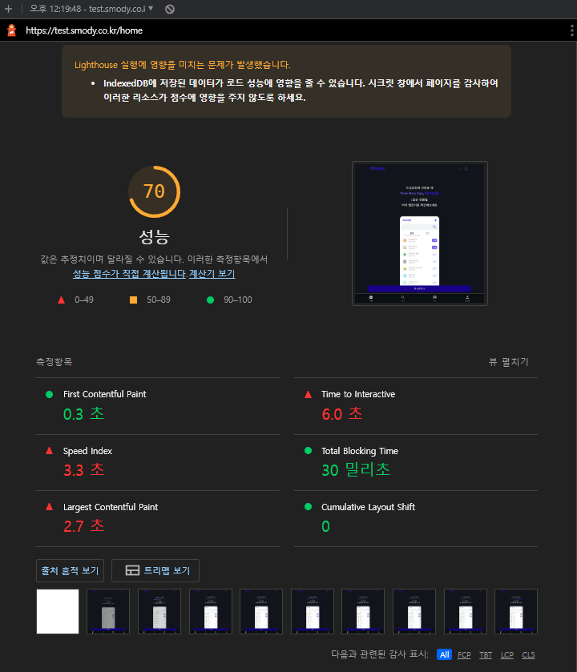
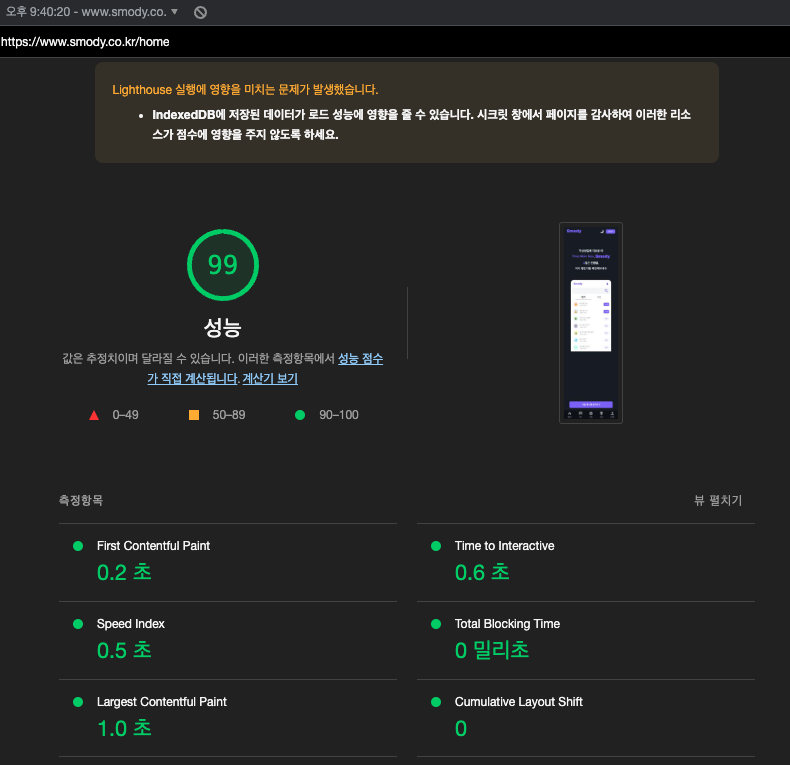

# 1. 성능 측정

## 1-1. 성능 측정 지표

[Web Vitals](https://web.dev/vitals/)에서 권장하는 아래와 같은 성능 측정 지표를 따르려 한다.

- LCP(**[Largest Contentful Paint, 최대 콘텐츠풀 페인트)](https://web.dev/lcp/)**: `로딩` 성능을 측정합니다. 우수한 사용자 경험을 제공하려면 페이지가 처음으로 로딩된 후 `2.5초` 이내에 LCP가 발생해야 한다.
- FID(**[First Input Delay, 최초 입력 지연)](https://web.dev/fid/)**: `상호 작용`을 측정합니다. 우수한 사용자 경험을 제공하려면 페이지의 FID가 `100밀리초` 이하여야 한다.
- CLS(**[Cumulative Layout Shift, 누적 레이아웃 시프트)](https://web.dev/cls/)**: `시각적 안정성`을 측정합니다. 우수한 사용자 경험을 제공하려면 페이지에서 `0.1` 이하의 CLS를 유지해야 한다.
  - 단, 버튼을 누른 이벤트에 의해 레이아웃이 변경되는 예시처럼 사용자가 화면의 변화를 예측할 수 있는 상황이라면 성능 측정의 대상으로 포함되지 않는다.

Lighthouse를 통해 성능을 측정하면 LCP와 CLS를 측정할 수 있다. FID의 경우 Lighthouse로 측정이 불가능하지만, 대신 대체할 수 있는 TBT(Total Blocking Time)가 Lighthouse에서 제공된다. 따라서 해당 지표들은 Lighthouse를 통해 측정하기로 결정했다. TBT의 경우 Lighthouse에서 빠름의 기준이 되는 200ms 이하로 유지하는 것을 목표로 했다.

## 1-2. 성능 측정 결과

Lighthouse를 통하여 스모디 서비스의 성능을 측정하였다. Lighthouse에서 성능 점수가 70점으로서, 불안정한 네트워크 환경이나 오래된 기기의 경우 성능에 문제가 있지 않을까 싶다. 앞으로 설명할 다양한 웹 성능 최적화 방법을 적용한 결과, 데스크탑 기준으로 99점(이미지가 많은 페이지도 90점 상회)까지 올라갔다.

- 성능 개선 전

- 성능 개선 후

# 2. 요청 크기 줄이기

우선 요청하는 크기부터 줄이기로 결정했다.

js나 html에 대하여 기본적인 최적화는 webpack에서 production 모드인 경우 적용되고 있다.

## 2-1. gzip으로 압축

이러한 리소스를 gzip으로 압축함으로써 파일 크기를 약 3배 가까이 감소하는 효과를 얻을 수 있었다.
gzip으로 압축하는 방법은 Webpack에서 미리 압축하는 방법과 Nginx와 같은 웹서버에서 압축하는 방법이 있었다. Webpack 빌드 타임도 개선하기 위해 웹서버에서 압축하는 방법을 택하였다.
2가지 방법 모두 이전에 작성한 글에 기록했으니 참고 바란다.

[gzip으로 리소스 압축(웹서버 또는 Webpack 방법) | Marco](gzip-compression.md)

## 2-2. 이미지 압축, 변환, 적절한 사이즈 설정

이미지는 리소스에서 많은 용량을 차지하기 때문에 압축하거나 webp와 같은 차세대 형식으로 변환하는 것이 중요하다.
압축 및 변환을 웹팩으로 빌드할 때마다 플러그인을 통하여 처리할지, 컴퓨터에서 직접 변경할지 고민한 결과, 정적 이미지의 경우 이미지의 추가 또는 교체가 자주 일어날 것 같지 않아 후자를 택하였다. 이미지를 압축하여 용량을 줄였다. 확장자는 webp로 변경했으며, webp를 지원하지 않은 브라우저도 대응하였다.

해당 방법 또한 이전에 작성한 글을 참고한다.

[웹 성능 최적화를 위해 이미지 크기 줄이기 | Marco](image-optimization.md)

# 3. 필요한 것만 요청하기

## 3-1. Code Splitting

리액트에서 페이지별로 Code Splitting하는 방법(React.lazy)을 통해 해당 페이지에서 필요한 스크립트만 불러오는 효과를 얻었다.

해당 방법 또한 이전에 작성한 글을 참고한다.

[페이지별 리소스 분리(Code Splitting, Tree Shaking)](code-splitting-tree-shaking.md)

# 4. 같은 것은 매번 새로 요청하지 않기

## 4-1. Http 캐시 설정

같은 것은 매번 새로 요청하지 않기 위해 브라우저의 Http 캐시를 이용할 수 있다.
Http 캐시를 적용하려면, 웹서버에서 보내주는 정적 리소스 응답 헤더에 cache-control을 설정해야 한다.

이전에 작성한 글은 다음과 같다.

[프론트엔드 nginx 웹 서버에서 http2 및 캐시 적용 방법 | Marco](http2-cache.md)

## 4-2. 서비스워커와 Cache Storage API를 통한 캐싱

위에서 설정한 브라우저의 HTTP 캐시는 HTTP 헤더와 브라우저의 기본 제공 휴리스틱의 조합에 의존한다.

대신에 서비스워커와 Cache Storage API는 캐싱에 대하여 코드 기반 접근 방식을 제공한다.

Cache Storage API를 사용하더라도 HTTP 캐시를 함께 사용하는 것이 좋다고 한다.

- URL에 버전이 지정되지 않은 리소스(ex, index.html)는 `Cache-Control`에 `no-cache`(재검증하여 캐시)나 `no-store`(절대 캐시 안함)을 적용하는 것을 고려한다.
- URL에 해시 같은 버전 정보가 포함된 리소스(ex, bundle.23zv8lcm13h.js)는 일반적으로 `Cache-Control`에 `max-age=31536000`(1년 캐시)를 적용한다.

Cache Storage API 캐시를 채울 때, 브라우저는 먼저 HTTP 캐시에서 기존 항목을 확인하고 발견된 경우 이를 사용하여 Cache Storage API 캐시를 채운다. 따라서, URL에 버전이 지정되지 않은 리소스에 대해 HTTP 캐시의 max-age를 길게 주면, Cache Storage API 캐시를 채울 때, 브라우저는 HTTP 캐시를 통해 오래된 해당 리소스만 계속 가져와서 문제가 될 수 있으니 조심해야 한다.

[[참고] 서비스 워커와 Cache Storage API | 구글](https://web.dev/service-workers-cache-storage/)

[[참고] 웹 서비스 캐시 똑똑하게 다루기 | 토스](https://toss.tech/article/smart-web-service-cache)

서비스워커와 Cache Storage API의 자세한 내용과 프로젝트에 적용했던 자세한 기록은 이전에 작성한 다음 글들을 참고한다.

[PWA의 핵심, 서비스 워커란? | Marco](../PWA/service-worker.md)

[오프라인 환경에서 웹 페이지 사용(Cache Storage, IndexedDB) | Marco](../PWA/offline-support.md)

# 5. 최소한의 변경만 일으키기

최소한의 변경만 일으키도록 React.memo를 적용하고 Layout Shift 없이 애니메이션을 작동하도록 수정했다.

이전에 작성한 글은 다음과 같다.

[렌더링 최적화 | Marco](rendering-optimization.md)

# 6. Http/2

많은 리소스를 빠르게 응답받기 위해 프론트엔드 웹서버에 Http/2를 적용했다.

이전에 작성한 글은 다음과 같다.

[프론트엔드 nginx 웹 서버에서 http2 및 캐시 적용 방법 | Marco](http2-cache.md)
